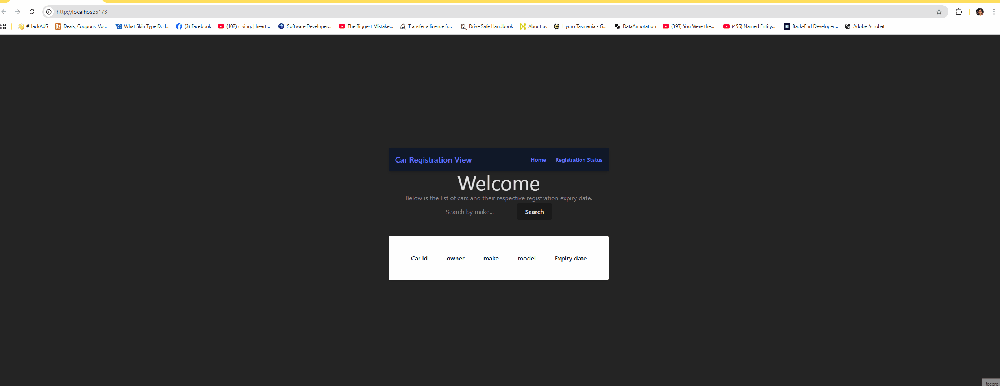
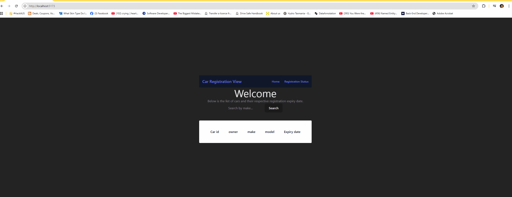
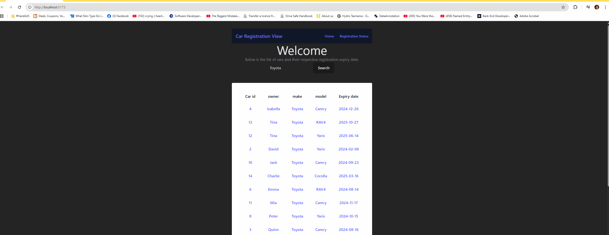

# Overview
A React Typescript frontend and C# ASP.NET 9 backend project to track the records for car' registration and it's expiry status from an existing JSON mock database.

# Current Development Status
*** Layout and css isn't designed efficiently yet with TailWindcss!
Working features including:
- A display of a table for all cars registration records or with optional {make} filter
- Designated page routers with Home Page or Registration Page
- Routing a selection of a car' table record on Home Page to Registration Page to view its current Registration Status.
- If a car registration id number hasn't existed in the mock database, a new registration record will be created with a random ExpiryDate and saved in the database file. Its record (regardless of pre-existing or new) is shown on a table with its Expiry Status

# Installation
Requires installation of:
- DotNet SDK 9.0 or 10.0
- npm v11
- C# SDK

Run the project in Visual Studio Code. Open a powershell or Linux terminal and run the following commands:

- cd into backend folder and then run the following to restore necessary NuGet packages:

dotnet restore
- Build && run the backend server:

dotnet run

Simultaneously, cd into frontend folder and then run following to open a browser connection:

npm install

npm run dev

# Working Demo
**View all cars or filtered ones by 'make' type functionality

**View cars filtered by 'make' type functionality

**Choosing a car record from Home Page and re-direct to Rego Page to see its expiration status

